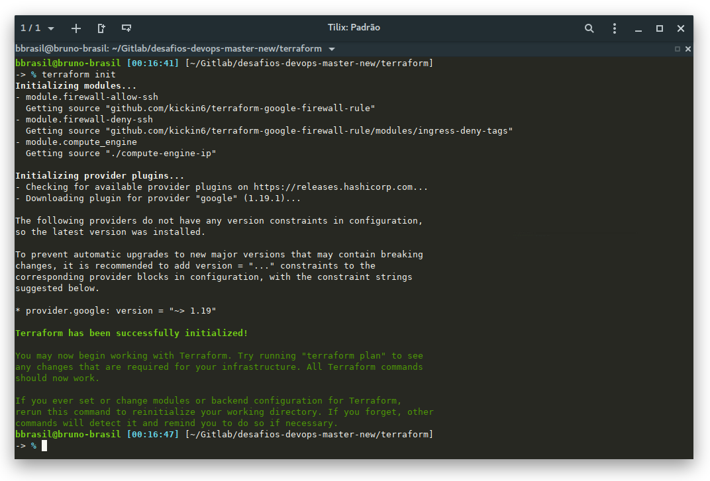
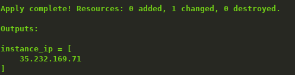

# Desafio 01: Infrastructure-as-code - Terraform

## Motivação

Recursos de infraestrutura em nuvem devem sempre ser criados utilizando gerenciadores de configuração, tais como [Cloudformation](https://aws.amazon.com/cloudformation/), [Terraform](https://www.terraform.io/) ou [Ansible](https://www.ansible.com/), garantindo que todo recurso possa ser versionado e recriado de forma facilitada.

## Objetivo

-   Criar uma instância **n1-standard-1** (GCP) ou **t2.micro** (AWS) Linux utilizando **Terraform**.
-   A instância deve ter aberta somente às portas **80** e **443** para todos os endereços
-   A porta SSH (**22**) deve estar acessível somente para um _range_ IP definido.
-   **Inputs:** A execução do projeto deve aceitar dois parâmetros:
-   O IP ou _range_ necessário para a liberação da porta SSH
-   A região da _cloud_ em que será provisionada a instância
-   **Outputs:** A execução deve imprimir o IP público da instância


## Extras

-   Pré-instalar o docker na instância que suba automáticamente a imagem do [Apache](https://hub.docker.com/_/httpd/), tornando a página padrão da ferramenta visualizável ao acessar o IP público da instância
-   Utilização de módulos do Terraform

## Notas
-   Pode se utilizar tanto AWS quanto GCP (Google Cloud), não é preciso executar o teste em ambas, somente uma.
-   Todos os recursos devem ser criados utilizando os créditos gratuitos da AWS/GCP.
-   Não esquecer de destruir os recursos após criação e testes do desafio para não haver cobranças ou esgotamento dos créditos.

# Resolução do Desafio

Abaixo segue a documentação quanto a Resolução do desafio proposto.

## Arquivos

-   **terraform/compute-engine-ip** - Modulo customizado com correções do projeto original ([terraform-google-compute](https://github.com/akbaribnu/terraform-google-compute));
-   **terraform/account.json**      - Dados da conta de serviço a ser utilizada pelo terraform;
-   **terraform/startup_script.sh** - Script que realiza configurações no boot da instância no GCP;
-   **terraform/variables.tf**      - Arquivo para configuração rápida;
-   **terraform/webserver.tf**      - Arquivo de configuração do Terraform.

## Pré Requisitos
*   Terraform v0.11.8
 -    Plugin: provider.google v1.19.1
 -    Modulo: [firewall-rule 0.1.1](https://registry.terraform.io/modules/kickin6/firewall-rule/google/0.1.1)
 -    Modulo: [terraform-google-compute](https://github.com/akbaribnu/terraform-google-compute) Modulo customizado com correções do projeto original (./compute-engine-ip);
* Projeto no GCP com _Billing_ habilitado (o projeto utiliza apenas recursos do _free tier_)

## Instalação

São necessárias as configurações abaixo para a implementação da solução utilizando o Terraform:

1.  Inicializar os Módulos e Plugins do Terraform:

```bash
terraform init
```


2.  Revise todo a implementação:
```bash
terraform plan -var 'foo=bar'
```

3.  Estando tudo OK, inicie a implementação: (use _-auto-approve_ para pular a aprovação do _plan_ antes de aplicar)
```bash
terraform apply -var 'foo=bar'
```
4.  Ao termino será retornado o IP público da instância no GCE.



## Configurações
### Conta de Serviço
É fundamental a criação ou utilização de uma Conta de Serviço no GCP, com permissões de EDITOR no GCE. Coloque o _path_ da chave JSON gerada na criação da conta de serviço na variavel de ambiente **service_account_json**, editando o arquivo **terraform/variables.tf** ou passando como parâmetro

[Documentação Oficial - "Como criar e gerenciar contas de serviço"](https://cloud.google.com/iam/docs/creating-managing-service-accounts)


### Váriaveis de Configuração
  Edite as variáveis no arquivo de configuração rápida, ou passe como referência no console.

| Parâmetro              | Valores Padrão                                     | Definição                                        |
| ---------------------- | -------------------------------------------------- | ------------------------------------------------ |
| gcp_project            | {}                                                 | Código do Projeto a ser utilizado                |
| gcp_region             | us-central1                                        | Código da Região a ser utilizada                 |
| service_account_json   | {}                                                 | PATH para a chave JSON da Conta de Serviço       |
| vpc                    | default                                            | VPC a ser utilizada                              |
| ssh_allowed_range_ip   | 0.0.0.0/0                                          | Range de IP liberado para conexão SSH (22)       |
| ssh_denied_range_ip    | 0.0.0.0/0                                          | Range de IP bloqueado para conexão SSH (22)      |
| tags_network           | http-server, https-server, allowed-ssh, denied-ssh | Tags para fácil aplicação das regras de firewall |
| key_pub                | ~/.ssh/id_rsa.pub                                  | PATH para a chave pública para acesso SSH        |
| gce_instance_name      | webserver                                          | Nome da Instância                                |
| gce_instance_type      | n1-standard-1                                      | Tipo da Instância                                |
| gce_instance_disk_type | pd-standard                                        | Tipo do Disco da Instância                       |
| size_root_disk         | 50                                                 | Tamanho do Disco da Instância (GBi)              |
